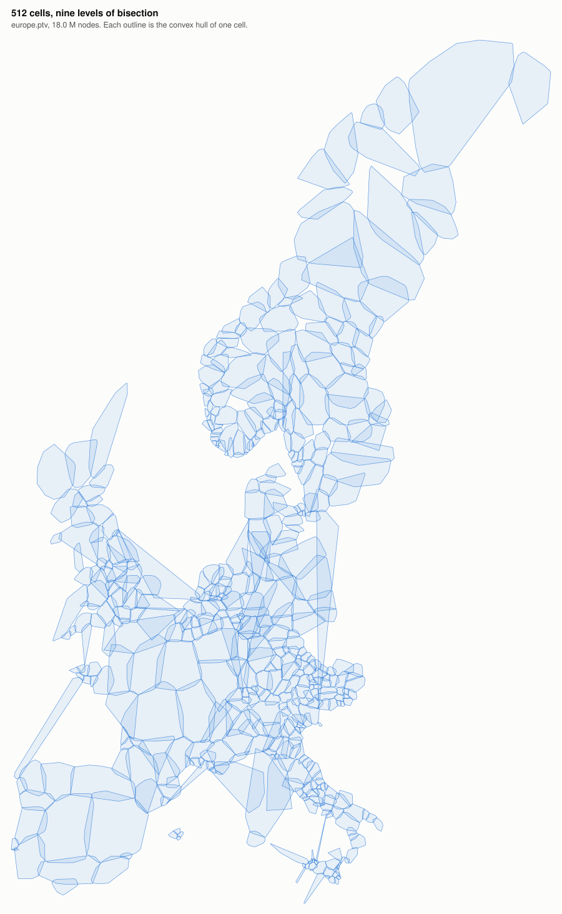
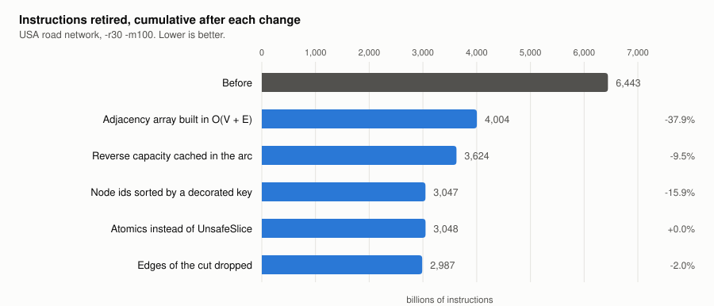
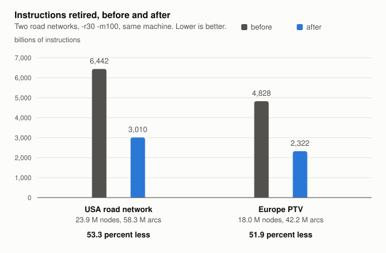

## The Toolbox 🧰 🦀

### Aug, 10th 2026: Cutting the work of the partitioner in half

Chipper takes a road network and cuts it into cells. It picks a cut with the Inertial Flow method, splits the graph along that cut, and repeats on both halves until the pieces are small enough. On the road network of the USA that means about eighteen useful levels of recursion and roughly 365,000 cells at the end.

The tool worked. It was also doing about twice as much work as it needed to. This post walks through what the work actually was, what removing it did, and which two attempts looked promising and then failed to pay off.

The picture above is the output after nine levels, drawn from the convex hulls that the scaffold tool writes as GeoJSON. The long thin shapes are cells whose nodes wrap around water, so their convex hull spans the gap.

#### Measuring first

Wall clock time on a laptop is a poor measuring stick. Repeated runs of the same binary on the same input varied by up to 26 percent here, which is more than most of the individual changes below are worth. Instructions retired, which `/usr/bin/time -l` reports on macOS, varied by less than one percent between repeated runs. So instructions retired is the number this post trusts, and wall clock is reported alongside it as a sanity check.

Two inputs were used, both with `-r30 -m100`, the invocation from the README. The USA road network from the 9th DIMACS challenge has 23.9 million nodes and 58.3 million arcs. The europe.ptv instance has 18.0 million nodes and 42.2 million arcs.

A change that makes the tool faster and the partition worse is not a win, so every step was also checked by hashing the full assignment and counting how many edges the final partition cuts.

#### Where the time went

A sampling profiler answers this, but the answer arrives in a useless shape at first. With link time optimization on, almost everything is inlined into one symbol, and the profile says that 69 percent of the time is spent in `sub_step` without saying what `sub_step` was doing. Marking four functions `#[inline(never)]` for one throwaway build gives the real picture:

| function | share of run time |
| --- | --- |
| `Dinic::bfs` | 26.9 percent |
| `sub_step` itself | 24.4 percent |
| sorting node ids | 11.3 percent |
| threads waiting | 7.9 percent |
| `Dinic::from_edge_list` | 6.7 percent |
| `Dinic::dfs` | 2.4 percent |

An earlier profile of the untouched code put a comparison sort inside `from_edge_list` at about 24 percent on its own. That is where this started.

#### Building the flow graph without sorting it

The max flow solver needs a residual graph. For every arc of the input it needs a reverse arc of zero capacity, so that flow can be pushed back later. The old code built that by copying the entire edge list onto itself, flipping the copy, sorting all of it by source and target, and then merging the duplicates back together.

Sorting is the expensive part, and it is not needed. The node ids of a cell are already numbered densely from zero, which is exactly the situation a counting sort is for. Count how many arcs each node owns, turn the counts into offsets with a prefix sum, and scatter the arcs into their blocks. That builds the adjacency array directly in linear time. Only the individual blocks still get sorted, and a block in a road network holds about five arcs.

The result was 37.9 percent fewer instructions for the whole run, and the partition it produced was identical bit for bit.

#### The lookup that dominated the BFS

With the sort gone, the breadth first search became the most expensive part of the program. Its inner loop walks the arcs of a node, and for each arc it needs to know the capacity of the arc pointing the other way. It found that arc by scanning the adjacency block of the head until the target matched.

The obvious fix is a table holding the id of the reverse arc for every arc, filled in once when the graph is built. That was tried first. It cut instructions by 4 percent and made the program slower. Filling the table costs a binary search per arc, and those searches jump all over the edge array. The instruction count went down while the cache behaviour got worse, which is exactly the situation where counting instructions alone would have misled.

The version that worked stores the capacity of the reverse arc inside each arc instead of its id. The breadth first search then needs no lookup at all, because the value it wants is already in the record it is reading. Two details make this cheap. The value can be filled in during the scatter, since an input arc contributes its capacity to the forward arc and to the reverse capacity of its partner, so no extra pass is needed. And the adjacency array entry had four bytes of padding sitting unused next to the node id, so the cache costs no memory.

The depth first search does still have to find the partner arc, because it keeps both halves of a pair in step when it pushes flow. A binary search serves, since the targets inside a block are sorted, and it runs once per arc on an augmenting path rather than once per step of the search. This was worth 9.5 percent of the remaining instructions and 13 percent of the CPU time, again with a bit identical partition.

#### Sorting node ids without chasing pointers

Inertial Flow sorts the nodes of a cell by their position projected onto one of four axes. The code did that with `sort_unstable_by_key`, where the key function reads the coordinate of the node. That is convenient and it means every single comparison performs a random read into a coordinate array of 24 million entries. A sort does on the order of n log n comparisons, so that is a lot of cache misses to compute a value that only takes n evaluations to precompute.

Attaching the projected value to each id once and sorting the pairs removed 16 percent of the instructions. This is the one change that alters the result, because ties between nodes with the same projected position now break differently. The partition it produces cuts 52 fewer edges out of 2.7 million, so the tie breaking is not worse.

#### Removing the unsafe code, for free

The partitioner wrote its cell ids through a helper called `UnsafeSlice`, which hands out mutable references from a shared one. The reasoning behind it was sound. Cells are disjoint, so no two threads ever write the same entry. The helper itself was not sound, because it was `Sync` and its read method was safe, so two threads could take a shared reference and a mutable reference to the same index without writing `unsafe` anywhere.

Relaxed atomics make the same claim the helper was making, but they differ in what happens when the claim turns out to be wrong. `UnsafeSlice` states it as a promise to the compiler, and a broken promise there is undefined behaviour, which means the compiler is entitled to generate code on the assumption that it cannot happen. An atomic makes the access legal whether the claim holds or not. A mistake then costs a wrong cell id instead of a program optimised on a false premise. For an invariant that no tool checks, that is the better failure mode.

Which ordering to ask for is the interesting part, and it is where the shape of the program pays off. `Relaxed` promises nothing about any other memory. It only guarantees that the access itself is not a data race and that repeated reads of one location see a coherent sequence of values. That is enough here, for two separate reasons. Within a level, a thread only ever reads entries it wrote itself, because once the edges of the cut are dropped both endpoints of every edge belong to the cell being split. Between levels, the parallel loop joins, and that join is what makes the writes of one level visible to the next.

In other words the ordering was already there, supplied by the fork and join of the parallel iterator, and it did not need to be bought a second time. Reaching for `Acquire` and `Release` out of caution would have paid for a guarantee the program already had. This is the useful thing about naming an ordering explicitly: it forces the question of which happens-before edges the code actually depends on, and in this case the answer was none that the atomics had to provide.

On x86-64 and on AArch64 a relaxed load and a relaxed store compile to the same instructions as a plain load and a plain store, so none of this costs anything to execute. The measurement agrees. The difference was 0.03 percent, which is noise, and the partition came out identical. The partitioner now contains no `unsafe` at all, and the helper, which had no user left in the crate, was deleted in [#543](https://github.com/DennisOSRM/toolbox-rs/pull/543).

#### Dropping the edges of the cut

When a cell splits, its edges have to be handed down to the two halves. The old code decided by the tail of each edge only. An edge running from the left half to the right half therefore stayed with the left half, and at the next level its head was renumbered into the flow graph as an extra node.

Such a node can never carry flow. Its only outgoing arc is a reverse arc with zero capacity, so the search reaches it and stops. It just made every flow graph a bit bigger than it needed to be, and the effect grows as cells get smaller and their boundary grows relative to their interior. Checking both endpoints and dropping the edges of the cut removed another 2 percent of the instructions.

#### What did not work

About a quarter of the machine sits idle during a run. The obvious suspect was the barrier at the end of each level, where every thread waits for the largest cell of that level to finish. Rewriting the driver as a recursion, with the two halves of a cell handed to a work stealing fork, removes that barrier entirely.

It made things slower. Wall clock went from 194 seconds to 203 and the average number of busy cores dropped from 6.0 to 5.7. The partition was identical, so this was purely a scheduling change, and the schedule got worse.

Two profiles explain it. Idle time is 54.6 percent during the first levels of the recursion and only 7.9 percent in the middle of the run. The threads are not waiting at the barrier. They are waiting at the top of the tree, where there is one cell to work on and the algorithm offers four independent tasks, one per axis. Eight cores cannot be kept busy by four tasks however they are scheduled, and fixing that needs parallelism inside a single cell.

#### Two bugs found on the way

Reading the code closely turned up two defects that had nothing to do with speed.

A node that no edge of its cell touches was dropped from both halves of a split. It then never descended again and kept a cell id from a level higher up, while every other node ended at the bottom of the hierarchy. At the root this affects any node that no edge of the whole graph touches, and isolated nodes are common in extracted road networks. Only a debug assertion at the very end of the program noticed, so release builds wrote the inconsistent ids out without complaint. A cell that none of the four axes managed to cut had the same problem for all of its nodes.

Both now descend properly. A cell with no edges at all used to hand an empty graph to the max flow solver, which indexed past the end of an array. It now reports an error.

#### Where it ended up

| metric | USA before | USA after | Europe before | Europe after |
| --- | --- | --- | --- | --- |
| wall clock | 332.1 s | 226.7 s | 274.7 s | 186.6 s |
| CPU time | 1892.2 s | 1171.3 s | 1572.0 s | 1028.2 s |
| instructions retired | 6,441.8 G | 3,009.7 G | 4,827.5 G | 2,322.0 G |
| peak memory | 10.26 GB | 11.02 GB | 7.37 GB | 7.05 GB |
| cut edges | 2,667,702 | 2,667,614 | 1,959,596 | 1,959,521 |

The instruction count roughly halves on both instances, and the cut gets slightly smaller on both. Peak memory moves in opposite directions, and the input format explains that. The old code always duplicated the edge list to build the reverse arcs. The DIMACS file lists both directions of every road, so most of those duplicates merged away again during deduplication. The DDSG file lists each arc once, so they did not.

The work is in [#542](https://github.com/DennisOSRM/toolbox-rs/pull/542).

### Jun, 13th 2022: Fixing a scalability issue

The recursive bi-partitioning exhibited a flaw in the amount of memory it allocated. The following graph shows how the performance regressed for levels greater or equal to 8. The graph shoots up exponentially. The issue was fixed in [#89](https://github.com/DennisOSRM/toolbox-rs/pull/89) by making sure that the per sub-graph memory allocation is independent of the overall graph size but only depends the size of the subgraph. Note that the speedup of the fixed version is super-liner.

